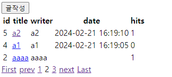
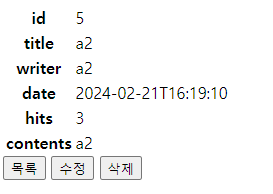

# Board_Recipe
스프링부트, mysql, jpa를 사용해서 만든 게시판입니다.

# 개발환경
1. IDE : IntelliJ IDEA Community
2. Spring Boot 2.6.13
3. JDK 11
4. mysql
5. Spring Data JPA
6. Thymeleaf

# 게시판 주요 기능
1. 글쓰기(/board/save)
2. 글목록(/board/)
3. 글조회(/board/{id})
4. 글수정(/board/update/{id})
    - 상세화면에서 수정 버튼 클릭
    - 서버에서 해당 게시글의 정보를 가지고 수정 화면 출력
    - 제목, 내용 수정 입력 받아서 서버로 요청
    - 수정 처리
5. 글삭제(/board/delete/{id})
6. 페이징처리(/board/paging)
   - /board/paging?page=2
   - /board/paging/2
   - 게시글 14개가 있으면
     - 한 페이지에 5개씩 -> 3개 페이지 필요
     - 한 페이지에 3개씩 -> 5개 페이지 필요
7. 파일(이미지) 첨부하기
    - 단일 파일 첨부
    - 다중 파일 첨부
    - 파일 첨부와 관련하여 추가될 부분들
      - save.html
      - BoardDTO
      - BoardService.save()
      - BoardEntity
      - BoardFileEntity, BoardFileRepository
      - detail.html
<br> <br>
### 페이징 화면 <br>

<br>


board_table(부모) - board_file_table(자식)
```
create table board_table
(
id             bigint auto_increment primary key,
created_time   datetime     null,
updated_time   datetime     null,
board_contents varchar(500) null,
board_hits     int          null,
board_pass     varchar(255) null,
board_title    varchar(255) null,
board_writer   varchar(20)  not null,
file_attached  int          null
);


create table board_file_table
(
id                 bigint auto_increment primary key,
created_time       datetime     null,
updated_time       datetime     null,
original_file_name varchar(255) null,
stored_file_name   varchar(255) null,
board_id           bigint       null,
constraint FKcfxqly70ddd02xbou0jxgh4o3
foreign key (board_id) references board_table (id) on delete cascade
);
```